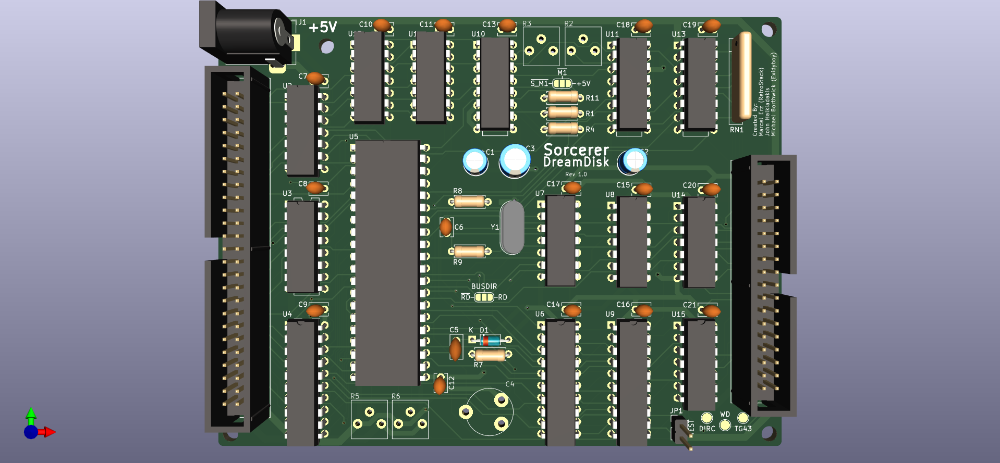

# Exidy Sorcerer DreamDisk - Disk Controller

A Disk Controller for the Exidy Sorcerer, based on the Disk Controller by DreamCards.

Requires SCUAMON3.4 Monitor ROMS with Dreamdisk FDC support installed in Sorcerer for Cold Booting Dreamdisk.

[Schematics](Current/Sorcerer_DreamDisk_Rev1_0_Schematics.pdf)

## Gerber Files
- [PCBWay](Current/Sorcerer_DreamDisk_Rev1_0_Gerber_PCBWay.zip)
- [JLCPCB](Current/Sorcerer_DreamDisk_Rev1_0_Gerber_JLCPCB.zip)

## Attribution
- Marcel Erz (RetroStack)
- John Halkiadakis
- Michael Borthwick (Exidyboy)

