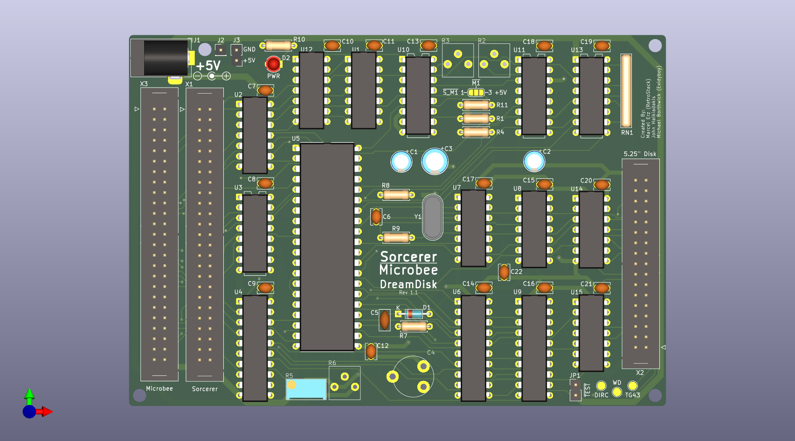

# Exidy Sorcerer/MicroBee DreamDisk - Disk Controller

A Disk Controller for the Exidy Sorcerer and MicroBee, based on the Disk Controller by DreamCards.

See the ["Notes for Testing Dreamdisk PCB.pdf"](http://filebrowser.exidysorcerer.net/) file at the [Exidy Sorcerer forum](https://www.exidysorcerer.net/) on how to setup and test the PCB including the jumpers.

CAUTION: ! This is currently untested !

[Schematics](Latest/Sorcerer_DreamDisk_Rev1_1_Schematics.pdf)

## Gerber Files
- [PCBWay](Latest/Sorcerer_DreamDisk_Rev1_1_Gerber_PCBWay.zip)
- [JLCPCB](Latest/Sorcerer_DreamDisk_Rev1_1_Gerber_JLCPCB.zip)

## Attribution
- Marcel Erz (RetroStack)
- John Halkiadakis
- Michael Borthwick (Exidyboy)

